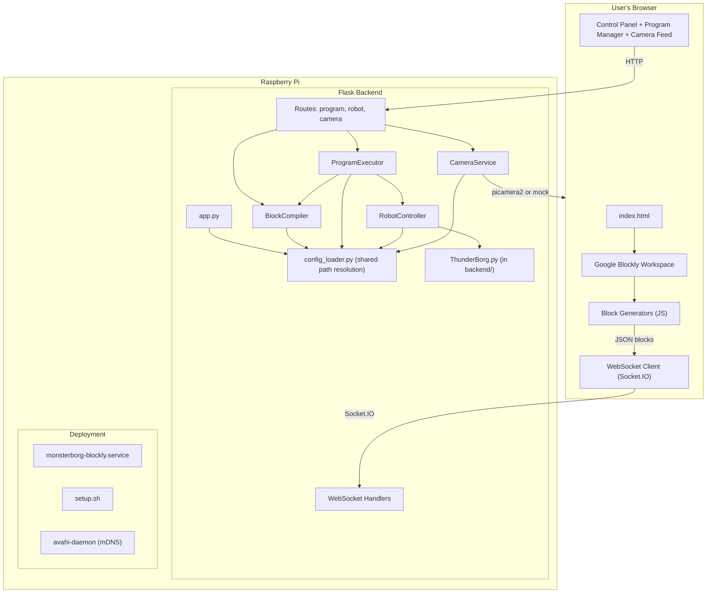

# Design Document: Deployment Readiness

## Overview

This design covers the full implementation needed to make the MonsterBorg Block-Based Coding Interface deployment-ready on a Raspberry Pi. The scope spans four major areas:

1. **Frontend**: Complete Blockly workspace with custom block definitions, code generators, camera feed, control panel, WebSocket integration, program management, and kid-friendly styling
2. **Camera Service**: MJPEG streaming backend with picamera2 support and mock fallback
3. **Bug Fixes**: Config path resolution, executor timeout key, ThunderBorg import
4. **Deployment**: Systemd service, comprehensive setup script, network/mDNS configuration

The existing backend (Flask + Flask-SocketIO, compiler, executor, robot controller, program/camera/robot routes) provides the foundation. This design fills in the missing frontend, the camera service implementation, fixes three backend bugs, and adds deployment automation.

## Architecture



### Key Design Decisions

1. **No build system for frontend** — The project uses vanilla HTML/CSS/JS. Blockly is loaded via CDN. This keeps deployment simple on the Pi (no Node.js required).

2. **Shared config loader utility** — A new `backend/config_loader.py` module resolves `config.yaml` using `__file__`-relative path computation. All other modules import from this single source, fixing the config path bug.

3. **ThunderBorg bundled in backend/** — Moving ThunderBorg.py into the package eliminates `sys.path` manipulation and makes imports reliable regardless of filesystem layout.

4. **Camera Service singleton with fallback** — The camera service detects picamera2 availability at import time and falls back to a frame-generating mock, ensuring the app always runs.

5. **Setup script requires root** — System-level package installation, I2C/camera enabling, and systemd service installation all require root. The script checks up front and exits early if unprivileged.

## Components and Interfaces

### Frontend Components

#### index.html
Single-page application that loads all dependencies and renders the workspace.

| Dependency | Source | Purpose |
|-----------|--------|---------|
| Google Blockly | CDN (`blockly_compressed.js`, `blocks_compressed.js`, `msg/en.js`) | Visual programming workspace |
| Socket.IO Client | CDN (`socket.io.min.js`) | Real-time WebSocket communication |
| main.css | Local | Application styles |
| blocks/*.js | Local | Custom block definitions |
| generators/*.js | Local | Block → JSON generators |
| main.js | Local | App initialization |
| websocket.js | Local | Socket.IO client logic |
| ui.js | Local | Control panel, program manager, camera panel |

#### Block Definition Files (frontend/js/blocks/)

Each file registers Blockly block definitions using `Blockly.Blocks[type]`:

- **movement.js**: `move_forward`, `move_backward`, `turn_left`, `turn_right`, `spin_circle`, `custom_move`
- **leds.js**: `set_led_color`, `led_preset`, `led_battery`
- **timing.js**: `wait`, `repeat`
- **patterns.js**: `pattern_square`, `pattern_triangle`, `pattern_circle`
- **control.js**: `stop`, `emergency_stop`

Each block definition specifies:
- `init()` method defining inputs, fields, colors, tooltips, help URLs
- Connection types (previousStatement/nextStatement for sequencing, statement inputs for nesting)
- Field dropdowns with kid-friendly labels (≤ 3 common words)
- Tooltips (≤ 15 words, second-grade vocabulary)

#### Generator Files (frontend/js/generators/)

- **json_generator.js**: A custom Blockly generator that walks the block tree and produces the JSON array expected by `POST /api/program/run`. Each block type has a generator function that extracts field values and returns a JSON object with `type` and parameter fields.

The generator implements value clamping: if a user somehow enters an out-of-range value, it's clamped to the nearest valid bound before serialization.

#### UI Module (frontend/js/ui.js)

Handles:
- Control panel button logic (Run, Stop, Save, Load, Clear)
- Program save dialog (name input, max 50 chars)
- Program load dialog (list display, sorted by modification date)
- Program delete confirmation
- Example programs section
- Camera feed panel (MJPEG `` element, placeholder on failure)
- Photo capture with thumbnail confirmation
- Emergency stop button (persistent, fixed position)

#### WebSocket Module (frontend/js/websocket.js)

Handles:
- Socket.IO connection establishment on page load
- `execution_progress` → block highlighting (yellow) + progress indicator
- `execution_finished` (completed) → green flash (≤ 2s) + reset
- `execution_finished` (stopped) → reset without animation
- `error` → red block highlight (if block_id provided) + simple error dialog
- Disconnect detection → status indicator + reconnect (3s interval, max 10 attempts)

### Backend Components

#### backend/config_loader.py (NEW)

```python
"""Shared configuration loading utility"""
import os
import yaml

# Compute project root: the directory containing config.yaml
# This works regardless of the current working directory
_PROJECT_ROOT = os.path.dirname(os.path.dirname(os.path.abspath(__file__)))
_CONFIG_PATH = os.path.join(_PROJECT_ROOT, 'config.yaml')

def get_config_path():
    """Return the absolute path to config.yaml"""
    return _CONFIG_PATH

def get_project_root():
    """Return the absolute path to the project root"""
    return _PROJECT_ROOT

def load_config():
    """Load and return the config dictionary"""
    if not os.path.exists(_CONFIG_PATH):
        raise FileNotFoundError(
            f"config.yaml not found at expected path: {_CONFIG_PATH}"
        )
    with open(_CONFIG_PATH, 'r') as f:
        return yaml.safe_load(f)

def save_config(config_dict):
    """Save config dictionary back to config.yaml"""
    with open(_CONFIG_PATH, 'w') as f:
        yaml.dump(config_dict, f)
```

All existing modules (`app.py`, `compiler.py`, `executor.py`, `robot_controller.py`, `camera.py`, `robot.py`, `program.py`) will be updated to use `from backend.config_loader import load_config` instead of `with open('config.yaml', 'r')`.

#### backend/services/camera_service.py (NEW)

```python
class CameraService:
    """Singleton camera service with picamera2 support and mock fallback"""
    _instance = None

    def __new__(cls):
        if cls._instance is None:
            cls._instance = super().__new__(cls)
            cls._instance._initialized = False
        return cls._instance

    def __init__(self):
        if self._initialized:
            return
        self.mock_mode = False
        self.camera = None
        self._running = False
        self._load_config()
        self._initialize_camera()
        self._initialized = True

    def _load_config(self): ...
    def _initialize_camera(self): ...  # try picamera2, fall back to mock
    def start(self): ...
    def stop(self): ...
    def generate_frames(self): ...  # yields MJPEG multipart frames
    def capture_photo(self, filepath) -> bool: ...
```

**Mock mode**: Generates frames using OpenCV (`cv2.putText` on a blank image) at configured resolution with "No Camera" text.

**Frame rate limiting**: Uses `time.sleep(1.0 / display_rate)` between frame yields to cap the output rate.

**Error recovery**: If picamera2 raises during streaming, catches the exception, logs it, releases resources, and switches to mock mode.

#### backend/ThunderBorg.py (MOVED)

The ThunderBorg.py file will be placed directly in `backend/`. The robot controller will import it as:

```python
try:
    from backend import ThunderBorg
except ImportError:
    ThunderBorg = None  # mock mode
```

No `sys.path.append()` calls to external directories.

#### Executor Config Fix

In `executor.py`, change:
```python
# Before (bug):
self.max_execution_time = config['safety']['max_execution_time']

# After (fix):
self.max_execution_time = config.get('robot', {}).get('max_execution_time', 300)
```

If the key is missing, default to 300 seconds and log a warning.

### Deployment Components

#### monsterborg-blockly.service (systemd unit)

```ini
[Unit]
Description=MonsterBorg Blockly Web Interface
After=network.target

[Service]
Type=simple
User=monsterborg
Group=monsterborg
WorkingDirectory=/opt/monsterborg-blockly
Environment="PATH=/opt/monsterborg-blockly/venv/bin:/usr/bin:/bin"
ExecStart=/opt/monsterborg-blockly/venv/bin/python3 -m backend.app
Restart=on-failure
RestartSec=5
StartLimitBurst=3
StartLimitIntervalSec=30
StandardOutput=journal
StandardError=journal

[Install]
WantedBy=multi-user.target
```

The service runs as a dedicated `monsterborg` user (member of `i2c`, `video` groups).

#### setup.sh (Enhanced)

The script will:
1. Check for root/sudo privileges (exit if not)
2. Install system packages: `python3 python3-pip python3-venv i2c-tools libcamera-apps python3-picamera2 avahi-daemon`
3. Enable I2C and camera interfaces (if not already enabled) via `raspi-config nonint`
4. Set hostname to "monsterborg" via `hostnamectl`
5. Create `monsterborg` user (if not exists) in `i2c` and `video` groups
6. Create Python venv and install from `requirements.txt` + `requirements-pi.txt`
7. Create data directories with correct ownership
8. Install and enable systemd service
9. Enable and start avahi-daemon

Each step checks if it's already satisfied (idempotent). Failures print error to stderr and exit non-zero (except avahi failure, which warns and continues).

## Data Models

### Block JSON Format (Frontend → Backend)

```typescript
interface Block {
  type: string;          // Block type name (e.g., "move_forward")
  // Parameters vary by type:
  distance?: number;     // meters (0.1 - 2.0)
  angle?: number;        // degrees (1 - 360)
  direction?: string;    // "left" | "right"
  rotations?: number;    // integer (1 - 3)
  left_power?: number;   // -1.0 to 1.0
  right_power?: number;  // -1.0 to 1.0
  duration?: number;     // seconds (0.1 - 10.0)
  r?: number;            // 0.0 to 1.0
  g?: number;            // 0.0 to 1.0
  b?: number;            // 0.0 to 1.0
  color?: string;        // preset name
  count?: number;        // integer (1 - 10)
  side_length?: number;  // meters (0.1 - 2.0)
  diameter?: number;     // meters (0.1 - 2.0)
  blocks?: Block[];      // nested blocks (for repeat)
}
```

### Saved Program Format (JSON file)

```typescript
interface SavedProgram {
  id: string;            // UUID
  name: string;         // User-provided name (1-50 chars)
  blocks: Block[];      // Array of block objects
  created: string;      // ISO 8601 timestamp
  modified: string;     // ISO 8601 timestamp
}
```

### Example Program Format (JSON file)

```typescript
interface ExampleProgram {
  id: string;           // Stable identifier
  name: string;         // Display name
  description: string;  // Short description
  difficulty: string;   // "beginner" | "intermediate" | "advanced"
  blocks: Block[];      // Array of block objects
}
```

### WebSocket Events

| Direction | Event | Payload |
|-----------|-------|---------|
| Client → Server | `run_program` | `{ blocks: Block[] }` |
| Client → Server | `stop_program` | `{}` |
| Client → Server | `get_status` | `{}` |
| Client → Server | `emergency_stop` | `{}` |
| Server → Client | `connected` | `{ status: 'ok' }` |
| Server → Client | `execution_started` | `{ execution_id, total_blocks }` |
| Server → Client | `execution_progress` | `{ execution_id, current_block, total_blocks, status }` |
| Server → Client | `execution_finished` | `{ execution_id, status, error? }` |
| Server → Client | `execution_stopped` | `{ status: 'stopped' }` |
| Server → Client | `error` | `{ message, block_id? }` |
| Server → Client | `battery_warning` | `{ voltage }` |
| Server → Client | `status_update` | `{ execution, robot }` |

### Camera Service Configuration (from config.yaml)

```yaml
camera:
  enabled: true
  width: 240
  height: 192
  framerate: 30      # hardware capture rate
  display_rate: 10   # streaming output rate (fps)
  jpeg_quality: 80
  flipped: true
```

## Correctness Properties

*A property is a characteristic or behavior that should hold true across all valid executions of a system — essentially, a formal statement about what the system should do. Properties serve as the bridge between human-readable specifications and machine-verifiable correctness guarantees.*

### Property 1: Block Metadata Constraints

*For any* custom Blockly block definition in the system, all field labels SHALL contain no more than 3 words AND the tooltip text SHALL contain no more than 15 words.

**Validates: Requirements 1.3, 1.4**

### Property 2: Block Generator Round-Trip

*For any* valid Blockly workspace state (any combination of connected blocks with valid parameters), converting the workspace to JSON and then loading that JSON back into the workspace SHALL produce a block arrangement with identical block types in the same order, the same nesting structure, and the same parameter values as the original.

**Validates: Requirements 2.1, 2.2, 2.3, 2.4, 2.6**

### Property 3: Block Generator Value Clamping

*For any* block field parameter value that falls outside its declared valid range, the Block Generator SHALL produce an output value clamped to the nearest valid bound (minimum or maximum of the range).

**Validates: Requirements 2.7**

### Property 4: Camera Mock Frame Generation

*For any* configured camera resolution (width × height), when running in mock mode the Camera Service SHALL produce valid JPEG-encoded frames with dimensions matching the configured width and height.

**Validates: Requirements 8.2**

### Property 5: Camera Frame Rate Limiting

*For any* configured display_rate value, the Camera Service's generate_frames method SHALL yield frames at a rate not exceeding the configured display_rate frames per second.

**Validates: Requirements 8.3**

### Property 6: Camera Singleton

*For any* number of CameraService instantiations, the same object instance SHALL be returned.

**Validates: Requirements 8.8**

### Property 7: Config Path Resolution Consistency

*For any* current working directory from which the application is launched, the config loader SHALL resolve config.yaml to the same absolute path, that path SHALL be readable, and writes SHALL target the same file as reads.

**Validates: Requirements 9.1, 9.3, 9.4**

### Property 8: Execution Timeout Enforcement

*For any* positive max_execution_time value configured in robot.max_execution_time, when a program's elapsed execution time exceeds that value, the executor SHALL stop execution, set status to 'error', and call emergency_stop.

**Validates: Requirements 10.4**

### Property 9: Graceful Hardware Degradation

*For any* environment where the ThunderBorg hardware library cannot be imported, the robot controller SHALL activate mock mode, and *for any* robot control request (drive, spin, set LEDs, get status) issued in mock mode, the controller SHALL return a response with the expected data structure without raising unhandled exceptions.

**Validates: Requirements 11.3, 11.4**

### Property 10: Setup Script Idempotency

*For any* Raspberry Pi system state where all dependencies are already installed and interfaces are already enabled, executing the setup script SHALL complete successfully without error, producing no change in system state.

**Validates: Requirements 13.8**

### Property 11: Program List Sort Order

*For any* set of saved programs with distinct modification timestamps, the program list endpoint SHALL return them sorted by most recently modified first.

**Validates: Requirements 6.2**

## Error Handling

### Frontend Errors

| Scenario | Handling |
|----------|----------|
| WebSocket disconnect | Show connection status indicator, retry every 3s (max 10 attempts), then show "reload page" message |
| Camera stream failure | Show placeholder image with "Camera unavailable" text after 5s timeout |
| API request failure (save/load/delete) | Show error message in dialog, preserve workspace state |
| Empty workspace on Run | Show friendly message ("Add some blocks first!"), don't send request |
| Photo capture failure | Show error message, keep button enabled for retry |

### Backend Errors

| Scenario | Handling |
|----------|----------|
| config.yaml not found | Fail at startup with clear error message showing expected path |
| robot.max_execution_time missing | Default to 300s, log warning |
| ThunderBorg import failure | Activate mock mode, log WARNING |
| Camera hardware error during streaming | Log error, release resources, switch to mock mode, continue serving |
| capture_photo I/O error | Return False, don't raise |
| Program execution error | Set LED red, stop motors, emit error event with message |
| Execution timeout | Emergency stop, set status 'error', emit execution_finished |

### Deployment Errors

| Scenario | Handling |
|----------|----------|
| Setup script run without root | Print error, exit with non-zero code, no changes made |
| Package installation failure | Print failed step + error output to stderr, exit non-zero |
| avahi-daemon install/enable failure | Print warning, continue with remaining steps |
| I2C/camera already enabled | Skip step, no error |
| Service restart loop (3 failures in 30s) | systemd stops restart attempts, service stays down (check journal) |

## Testing Strategy

### Unit Tests (pytest)

Focus on concrete examples and edge cases:

- **config_loader**: Verify path resolution produces absolute path, verify FileNotFoundError message
- **compiler**: Test each block type produces correct command structure, test unknown block types
- **executor**: Test timeout triggers emergency_stop, test stop signal halts execution
- **camera_service**: Test start/stop lifecycle, test capture_photo with valid/invalid paths
- **robot_controller**: Test mock mode responses for all command types

### Property-Based Tests (Hypothesis)

The project will use [Hypothesis](https://hypothesis.readthedocs.io/) for property-based testing in Python.

Configuration:
- Minimum 100 examples per test
- Each test tagged with feature and property reference

**Property tests to implement:**

1. **Block metadata constraints** (Property 1): Generate block definition metadata, verify label word count ≤ 3 and tooltip word count ≤ 15.
   - Tag: `Feature: deployment-readiness, Property 1: Block field labels ≤ 3 words AND tooltips ≤ 15 words`

2. **Block generator round-trip** (Property 2): Generate random valid workspace states (random block types with random valid parameters), serialize to JSON, deserialize back, compare.
   - Tag: `Feature: deployment-readiness, Property 2: workspace → JSON → workspace preserves block types, order, nesting, and parameters`

3. **Block generator clamping** (Property 3): Generate random parameter values (including out-of-range), verify output is always within valid bounds.
   - Tag: `Feature: deployment-readiness, Property 3: out-of-range parameter values are clamped to nearest valid bound`

4. **Camera mock frame generation** (Property 4): Generate random resolutions, verify mock produces valid JPEGs at those dimensions.
   - Tag: `Feature: deployment-readiness, Property 4: mock mode produces valid JPEG frames at configured resolution`

5. **Camera frame rate limiting** (Property 5): Generate random display_rate values, measure frame timing, verify rate ≤ display_rate.
   - Tag: `Feature: deployment-readiness, Property 5: frame yield rate does not exceed configured display_rate`

6. **Camera singleton** (Property 6): Create multiple instances, verify identity.
   - Tag: `Feature: deployment-readiness, Property 6: CameraService() always returns same instance`

7. **Config path resolution** (Property 7): Generate random working directories (via os.chdir in test), verify resolved path is always the same absolute path.
   - Tag: `Feature: deployment-readiness, Property 7: config resolves to same absolute path from any working directory`

8. **Execution timeout** (Property 8): Generate random timeout values, run a program that sleeps longer, verify it's stopped.
   - Tag: `Feature: deployment-readiness, Property 8: execution stops when elapsed time exceeds max_execution_time`

9. **Mock mode command handling** (Property 9): Generate random control commands (drive values, spin angles, LED colors), verify mock mode returns valid responses without exceptions.
   - Tag: `Feature: deployment-readiness, Property 9: mock mode handles all robot commands without exceptions`

10. **Program list sort order** (Property 11): Generate random sets of programs with random timestamps, verify list endpoint returns them sorted descending by modified date.
    - Tag: `Feature: deployment-readiness, Property 11: program list is sorted by most recently modified first`

### Integration Tests

- **Camera stream end-to-end**: Start app, request `/api/camera/stream`, verify multipart response headers and JPEG frame boundaries
- **Program run lifecycle**: Send blocks via REST, verify execution_started, progress, and execution_finished events via WebSocket
- **Setup script on Pi**: Run on clean Raspberry Pi OS image, verify all services start correctly

### Frontend Tests

Given the vanilla JS stack (no build system), frontend testing will use:
- Manual testing for UI interactions, accessibility, and visual appearance
- Automated accessibility audit via browser DevTools (Lighthouse) for WCAG AA compliance
- Browser console checks for JavaScript errors during normal usage flows

Note: Full WCAG validation requires manual testing with assistive technologies and expert accessibility review.
